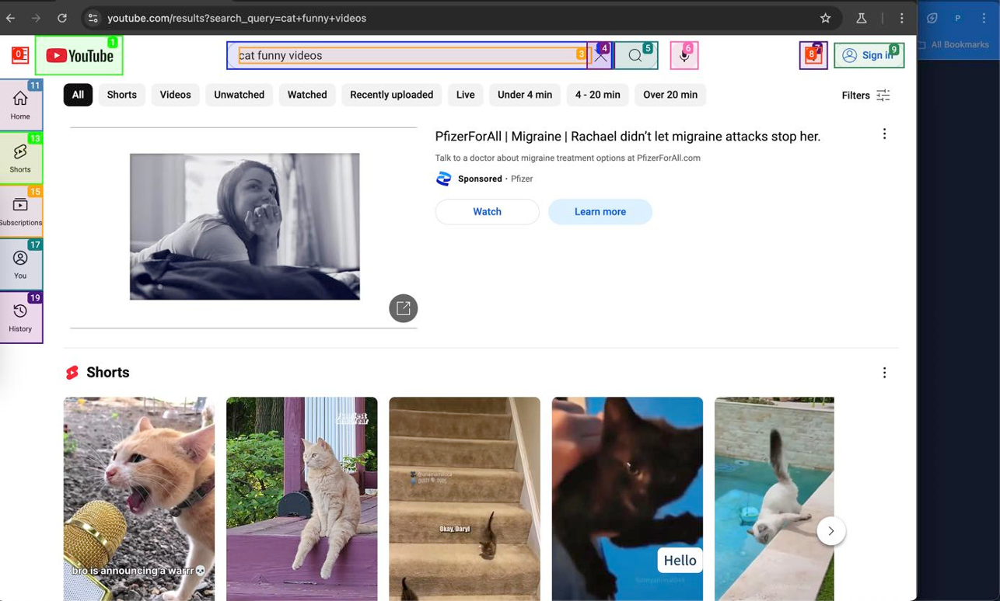

# Movable

## Overview

Movable is an AI-powered web navigation agent built with Nodejs, Nextjs, it automates tasks like adding items to e-commerce carts and composing emails. The project integrates the Gemini API for prompt generation and the ElevenLabs API for audio-to-text functionality. The agent collaborates with the [web-ui](https://github.com/browser-use/web-ui) repository, where tasks are executed, leveraging the agent's capabilities.

## Features

- **Web Navigation:** Automates browsing tasks using Playwright.
- **Task Automation:** Adds items to e-commerce carts and composes emails.
- **AI Integration:** Uses Gemini API for intelligent prompts.
- **Speech-to-Text:** Converts audio inputs to text via ElevenLabs API.
- **Full-Stack Design:** Combines a Next.js frontend with a Node.js backend, integrated with [web-ui](https://github.com/browser-use/web-ui).

## Tech Stack

- **Frontend:** Next.js, React, TypeScript, Tailwind CSS
- **Backend:** Node.js, Playwright
- **APIs:** Gemini API (prompts), ElevenLabs API (audio-to-text)

## Installation

1. **Clone the Repository:**

   ```bash
   git clone https://github.com/pkrlfamous/movable
   cd movable
   ```
2. **Install Frontend Dependencies:**

   ```
   cd agent-ui
   yarn
   ```
3. **Install Backend Dependencies:**

   ```
   cd ../backend
   npm install
   ```
4. **Set Up Web-UI Dependency:**
   Clone the repo and follow what is installtion guide from that repo.

   ```
   git clone https://github.com/browser-use/web-ui.git

   ```

**5. Set Up Environment Variables:**

* Create a **.env** file in **backend/** directory.
* Add API keys for Gemini and ElevenLabs in the .env file (e.g., **GEMINI_API_KEY**, **ELEVENLABS_API_KEY**).

**6. Run the Application:**

* Frontend:

  ```
  cd agent-ui
  yarn dev
  ```
* Backend:

  ```
  cd backend
  npm start
  ```

## Usage

* Ensure [web-ui](https://github.com/browser-use/web-ui) is running, as it leverages the agent’s power for task execution.
* Launch the frontend (**agent-ui**) to interact with the UI.
* Use voice commands or text inputs to trigger tasks.
* The agent navigates websites and delegates task completion to **web-ui**.





